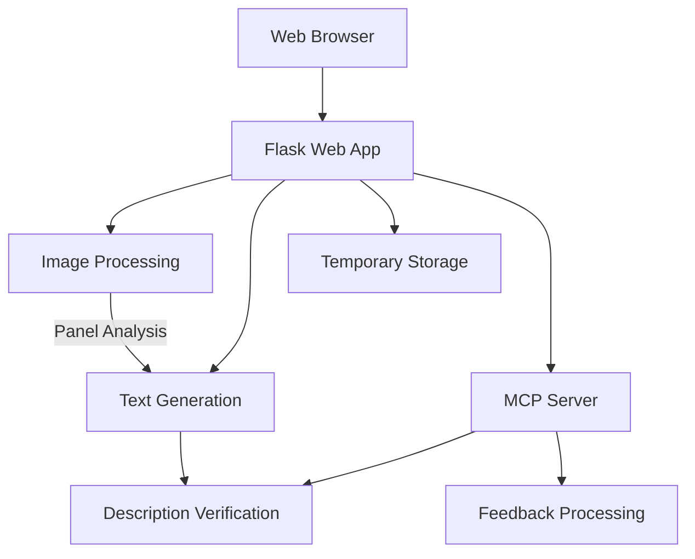
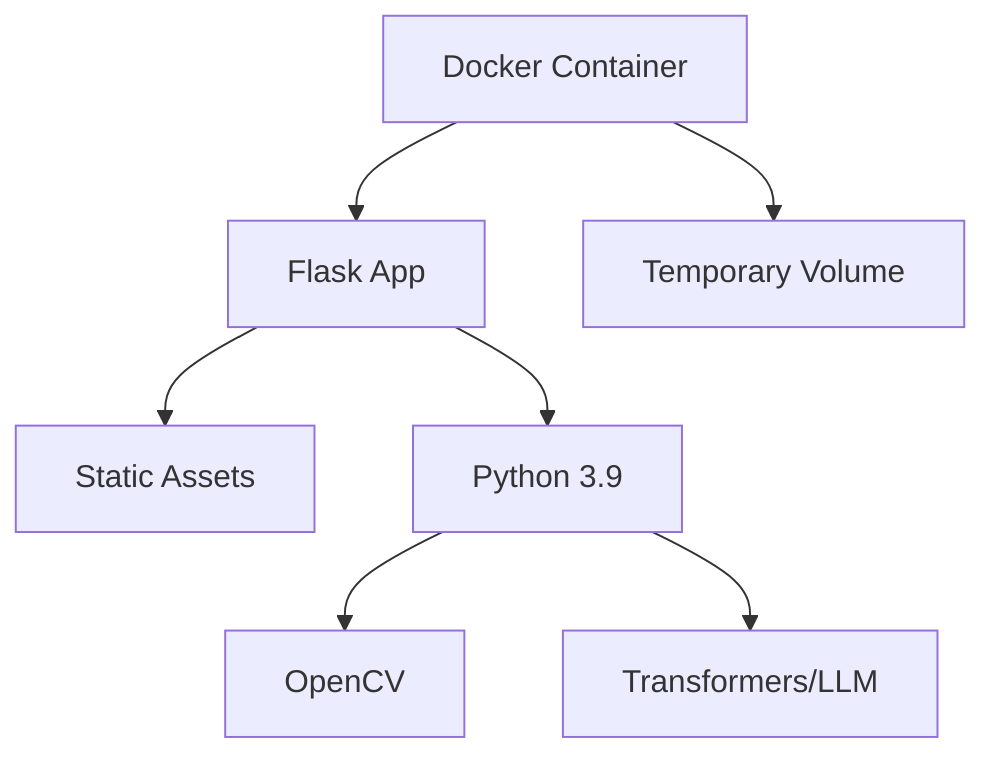
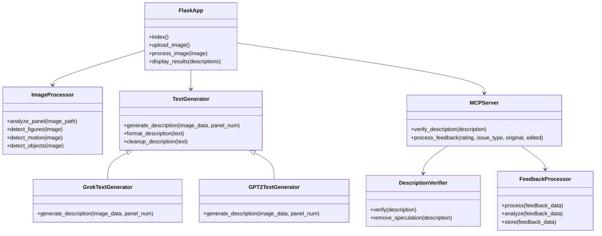
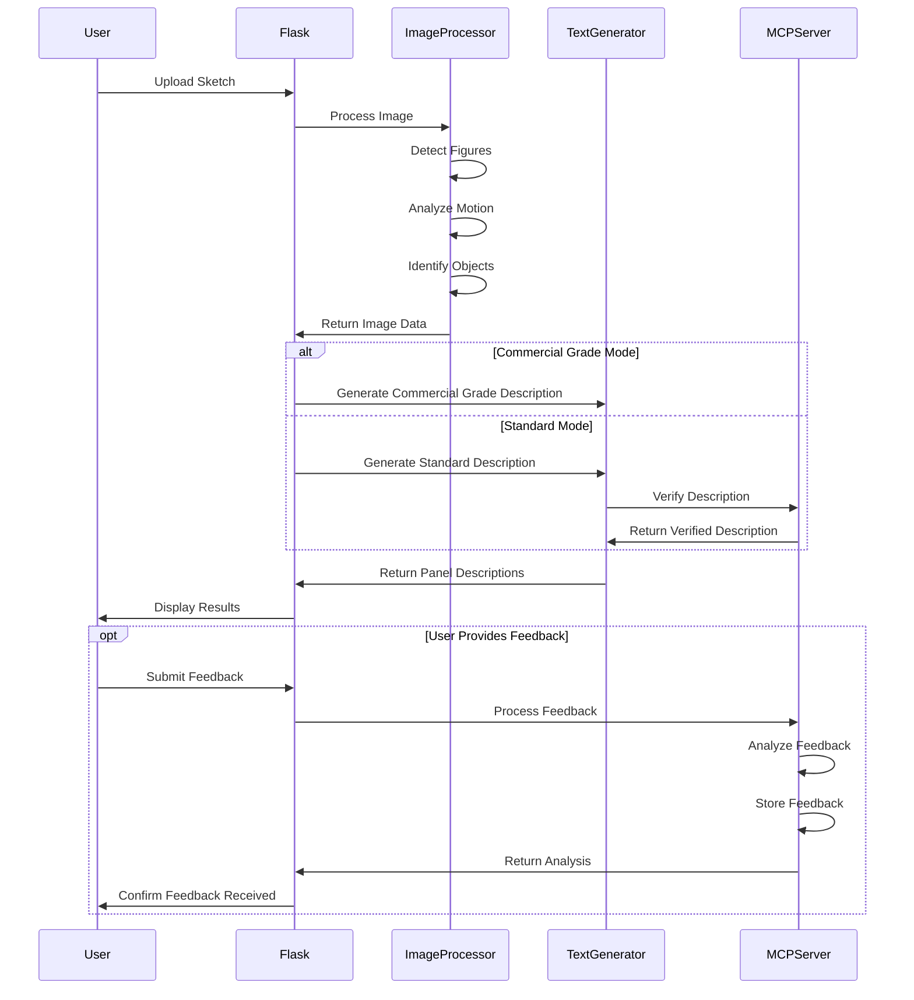

# Comic Panel Description Generator - System Patterns

## System Architecture

The Comic Panel Description Generator follows a streamlined single-container architecture designed for speed and simplicity:



### Components

1. **Web Interface**: Flask-based frontend for sketch upload and results display
2. **Image Processing**: OpenCV-based analysis of comic sketches
3. **Text Generation**: AI-powered generation of panel descriptions
4. **Temporary Storage**: Short-term storage for uploaded sketches during processing

## Container Structure

The project uses a single-container approach with Docker:



## Key Technical Decisions

### Containerization Strategy

- **Base Image**: Using official Python 3.9-slim as the base image
- **Dependency Management**: Installing only necessary packages to minimize container size
- **Layer Optimization**: Organizing Dockerfile instructions to maximize layer caching
- **Fast Startup**: Prioritizing quick container startup for rapid deployment

### Image Processing Approach

- **Edge Detection**: Using cv2.Canny with adjusted thresholds for better line detection in comics
- **Contour Analysis**: Advanced filtering of contours using area, aspect ratio, and solidity to accurately identify figures
- **Motion Detection**: Combined edge density and distribution analysis for more accurate action vs. static classification
- **Object Recognition**: Multi-factor analysis including edge intensity and small bright region detection for more accurate object identification
- **Sanity Checks**: Implementing reasonable upper limits and validation logic to prevent unrealistic detections

### Text Generation Strategy

- **Multi-Provider Approach**: Priority chain of APIs (OpenAI → Anthropic → Grok → DeepSeek → HuggingFace) with local model and rule-based fallbacks
- **Enhanced Prompt Engineering**: Detailed, context-rich prompts focused on accurate description of visible elements
- **System Instructions**: Clear guidance for LLMs to focus on factual descriptions and avoid exaggeration
- **Improved Formatting**: Consistent "Panel X: [description]" format with better text cleaning
- **Parameter Tuning**: Adjusted temperature and token limits for more accurate and concise descriptions
- **Rule-Based Fallback**: More nuanced rule-based generation as ultimate fallback
- **Commercial Grade Mode**: Option for ultra-factual descriptions with no interpretation
- **Description Verification**: Automated verification to remove speculative content and ensure factual accuracy
- **Feedback Processing**: System to collect, analyze, and learn from user feedback on descriptions

### Deployment Pattern

- **Single-Container**: Packaging all components in one container for simplicity
- **Environment Variables**: Using environment variables for configuration
- **Render.com Deployment**: Optimized for quick deployment to Render.com free tier
- **No Persistence**: Stateless design with temporary storage only

## Design Patterns

### Backend Patterns

- **MVC Architecture**: Separating concerns between models, views, and controllers
- **Service Layer**: Abstracting image processing and text generation behind service interfaces
- **Factory Pattern**: Creating appropriate text generation service based on configuration
- **Strategy Pattern**: Swappable strategies for text generation (Grok vs. GPT-2)

### Frontend Patterns

- **Minimalist Design**: Simple, functional interface focused on task completion
- **Progressive Enhancement**: Basic functionality works without JavaScript
- **Responsive Design**: Adapting to different screen sizes for mobile use
- **Immediate Feedback**: Clear indication of processing status

## Component Relationships



## Processing Flow



## Code Structure

The application follows a modular structure with clear separation of concerns:

```
/app
  ├── app.py           # Flask application
  ├── api_server.py    # API server for headless operation
  ├── vision.py        # OpenCV image processing
  ├── textgen.py       # Text generation (multi-provider)
  ├── mcp_client.py    # Client for MCP server interaction
  ├── static/          # CSS, JS, and static assets
  ├── templates/       # HTML templates
  │   ├── base.html    # Base template with common elements
  │   ├── index.html   # Upload form template
  │   └── result.html  # Results display template
  └── uploads/         # Temporary storage for uploads

/mcp_server
  ├── server.py        # MCP server main entry point
  ├── tools/           # MCP tools implementation
  │   ├── analyze_panel.py          # Panel analysis tool
  │   ├── classify_scene.py         # Scene classification tool
  │   ├── detect_objects.py         # Object detection tool
  │   ├── generate_description.py   # Description generation tool
  │   ├── verify_description.py     # Description verification tool
  │   └── process_feedback.py       # Feedback processing tool
  └── utils/           # Utility functions
      ├── image_utils.py            # Image processing utilities
      └── api_utils.py              # API interaction utilities
```

## Key Implementation Details

### vision.py
```python
import cv2
import numpy as np
import logging

def analyze_panel(image_path):
    # Load and process image
    img = cv2.imread(image_path, cv2.IMREAD_GRAYSCALE)
    img_blurred = cv2.GaussianBlur(img, (5, 5), 0)
    
    # Improved edge detection
    edges = cv2.Canny(img_blurred, 100, 200)
    
    # Advanced contour analysis
    contours, _ = cv2.findContours(edges, cv2.RETR_EXTERNAL, cv2.CHAIN_APPROX_SIMPLE)
    
    # Better figure detection with filtering
    filtered_contours = []
    for c in contours:
        area = cv2.contourArea(c)
        if area > 2000:  # Increased minimum area
            x, y, w, h = cv2.boundingRect(c)
            aspect_ratio = float(w) / h if h > 0 else 0
            hull = cv2.convexHull(c)
            hull_area = cv2.contourArea(hull)
            solidity = float(area) / hull_area if hull_area > 0 else 0
            
            if 0.2 < aspect_ratio < 5 and solidity > 0.1:
                filtered_contours.append(c)
    
    # Apply sanity checks
    figures = min(len(filtered_contours), 5)  # Cap at reasonable limit
    if figures == 0:
        figures = 1  # Default to at least one character
    
    # Improved motion detection
    edge_density = np.mean(edges) / 255.0
    edge_std_normalized = np.std(edges) / 255.0
    motion = "action" if edge_density > 0.08 and edge_std_normalized > 0.2 else "static"
    
    # Better object detection
    edge_max = np.max(edges)
    edge_std = np.std(edges)
    _, binary = cv2.threshold(img_blurred, 220, 255, cv2.THRESH_BINARY)
    spark_contours, _ = cv2.findContours(binary, cv2.RETR_EXTERNAL, cv2.CHAIN_APPROX_SIMPLE)
    small_bright_regions = len([c for c in spark_contours if 10 < cv2.contourArea(c) < 100])
    objects = "sparks" if edge_max > 220 and edge_std > 60 and small_bright_regions >= 3 else "none"
    
    return {"figures": figures, "motion": motion, "objects": objects}
```

### textgen.py
```python
import os
import logging
import requests
from transformers import pipeline

class MultiProviderTextGen:
    def __init__(self):
        # Load API keys from environment variables
        self.openai_key = os.environ.get('OPENAI_API_KEY', '')
        # Other API keys and configuration...
        
    def _create_prompt(self, image_data, panel_num=1):
        # Extract data from image analysis
        figures = image_data.get("figures", 1)
        motion = image_data.get("motion", "static")
        objects = image_data.get("objects", "none")
        
        # Create more descriptive prompt
        figure_text = f"{figures} character{'s' if figures > 1 else ''}"
        motion_text = "a dynamic" if motion == "action" else "a calm"
        motion_detail = "showing movement and energy" if motion == "action" else "with minimal movement"
        object_text = " with visual effects like sparks or impact lines" if objects == "sparks" else ""
        
        # Detailed prompt focused on accuracy
        return (
            f"Panel {panel_num}: Describe a comic panel showing {figure_text} in {motion_text} scene{object_text}. "
            f"The scene is {motion_detail}. Focus on what's actually visible in the panel, "
            f"describing the characters, their positions, and any visible text or speech bubbles. "
            f"Keep the description concise and accurate to what would be seen in a comic panel."
        )
    
    def generate(self, image_data, panel_num=1):
        prompt = self._create_prompt(image_data, panel_num)
        
        # Try each provider in priority order
        # OpenAI, Anthropic, Grok, DeepSeek, HuggingFace, local model, rule-based
        
        # Example of OpenAI generation
        if self.openai_key:
            try:
                return self._generate_with_openai(prompt)
            except Exception:
                # Fall back to next provider
                pass
        
        # Fallback to rule-based generation if all else fails
        return self._generate_rule_based(image_data, panel_num)

# Create singleton instance
text_generator = MultiProviderTextGen()

def generate_description(image_data, panel_num):
    return text_generator.generate(image_data, panel_num)
```
