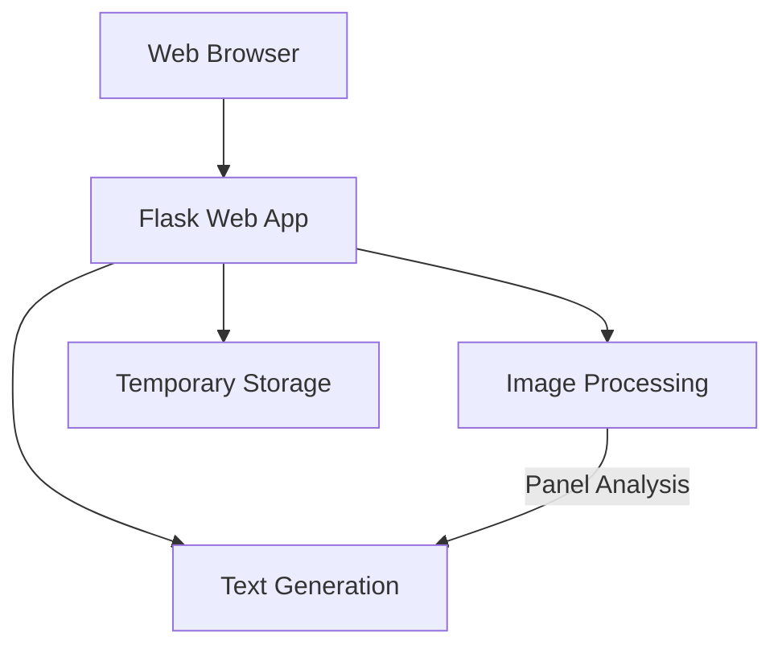
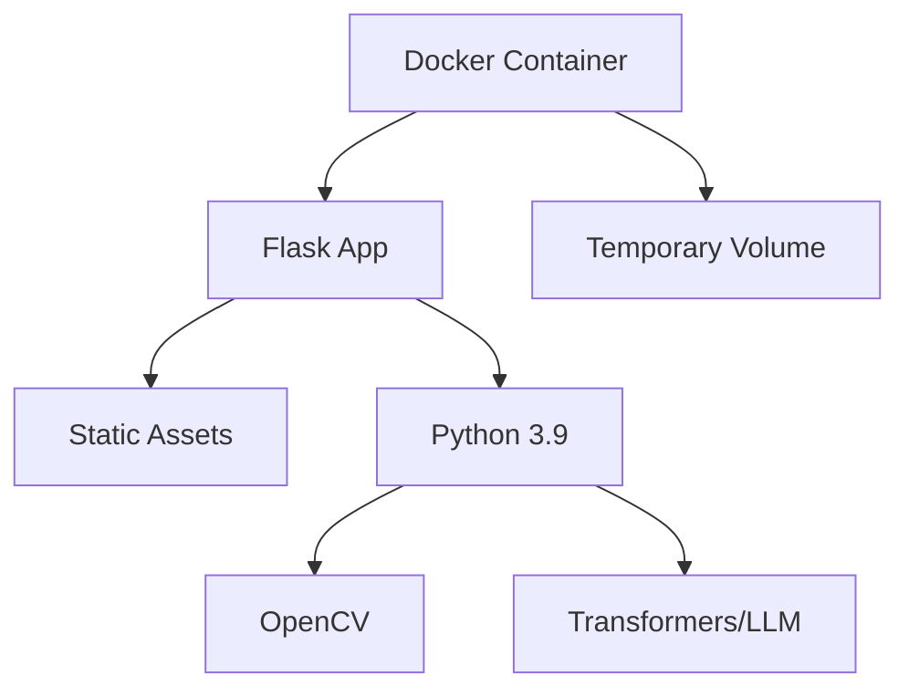
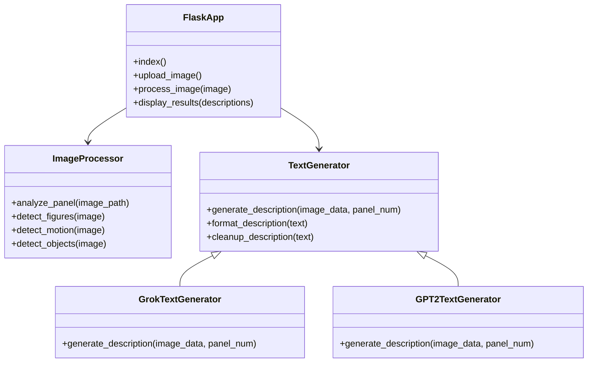
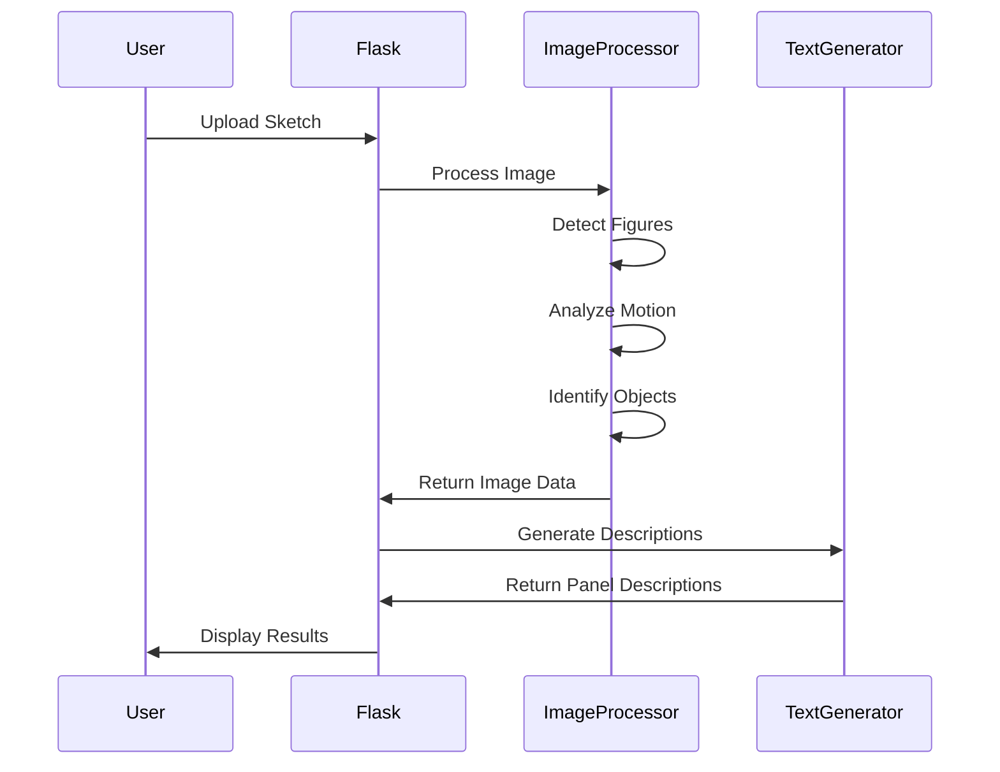

# Comic Panel Description Generator - System Patterns

## System Architecture

The Comic Panel Description Generator follows a streamlined single-container architecture designed for speed and simplicity:



### Components

1. **Web Interface**: Flask-based frontend for sketch upload and results display
2. **Image Processing**: OpenCV-based analysis of comic sketches
3. **Text Generation**: AI-powered generation of panel descriptions
4. **Temporary Storage**: Short-term storage for uploaded sketches during processing

## Container Structure

The project uses a single-container approach with Docker:



## Key Technical Decisions

### Containerization Strategy

- **Base Image**: Using official Python 3.9-slim as the base image
- **Dependency Management**: Installing only necessary packages to minimize container size
- **Layer Optimization**: Organizing Dockerfile instructions to maximize layer caching
- **Fast Startup**: Prioritizing quick container startup for rapid deployment

### Image Processing Approach

- **Edge Detection**: Using cv2.Canny for detecting lines and shapes in comic sketches
- **Contour Analysis**: Counting contours to identify figures and characters
- **Motion Detection**: Analyzing edge density to guess action vs. static scenes
- **Object Recognition**: Using edge intensity to identify special elements like sparks

### Text Generation Strategy

- **Dual Approach**: Supporting both Grok API (preferred) and GPT-2 (fallback)
- **Prompt Engineering**: Crafting prompts that capture comic panel essence
- **Output Formatting**: Consistent "Panel X: [description]" format
- **Length Control**: Keeping descriptions concise and useful

### Deployment Pattern

- **Single-Container**: Packaging all components in one container for simplicity
- **Environment Variables**: Using environment variables for configuration
- **Render.com Deployment**: Optimized for quick deployment to Render.com free tier
- **No Persistence**: Stateless design with temporary storage only

## Design Patterns

### Backend Patterns

- **MVC Architecture**: Separating concerns between models, views, and controllers
- **Service Layer**: Abstracting image processing and text generation behind service interfaces
- **Factory Pattern**: Creating appropriate text generation service based on configuration
- **Strategy Pattern**: Swappable strategies for text generation (Grok vs. GPT-2)

### Frontend Patterns

- **Minimalist Design**: Simple, functional interface focused on task completion
- **Progressive Enhancement**: Basic functionality works without JavaScript
- **Responsive Design**: Adapting to different screen sizes for mobile use
- **Immediate Feedback**: Clear indication of processing status

## Component Relationships



## Processing Flow



## Code Structure

The application follows a simple, functional structure:

```
/app
  ├── app.py           # Flask application
  ├── vision.py        # OpenCV image processing
  ├── textgen.py       # Text generation (Grok/GPT-2)
  ├── static/          # CSS, JS, and static assets
  ├── templates/       # HTML templates
  └── uploads/         # Temporary storage for uploads
```

## Key Implementation Details

### vision.py
```python
import cv2
import numpy as np

def analyze_panel(image_path):
    img = cv2.imread(image_path, cv2.IMREAD_GRAYSCALE) or np.zeros((100, 100))
    edges = cv2.Canny(img, 80, 150)  # Looser for comics
    contours, _ = cv2.findContours(edges, cv2.RETR_EXTERNAL, cv2.CHAIN_APPROX_SIMPLE)
    figures = len([c for c in contours if cv2.contourArea(c) > 300]) or 1
    motion = "action" if np.mean(edges) > 40 else "static"
    objects = "sparks" if np.max(edges) > 180 else "none"
    return {"figures": figures, "motion": motion, "objects": objects}
```

### textgen.py
```python
from transformers import pipeline

def generate_description(image_data, panel_num):
    gen = pipeline("text-generation", model="gpt2", device=-1)
    prompt = f"Panel {panel_num}: {image_data['figures']} character{'s' if image_data['figures'] > 1 else ''} in a {image_data['motion']} scene with {image_data['objects']}."
    desc = gen(prompt, max_length=40, num_return_sequences=1)[0]["generated_text"]
    return f"Panel {panel_num}: {desc.split('.')[0]}."
```
