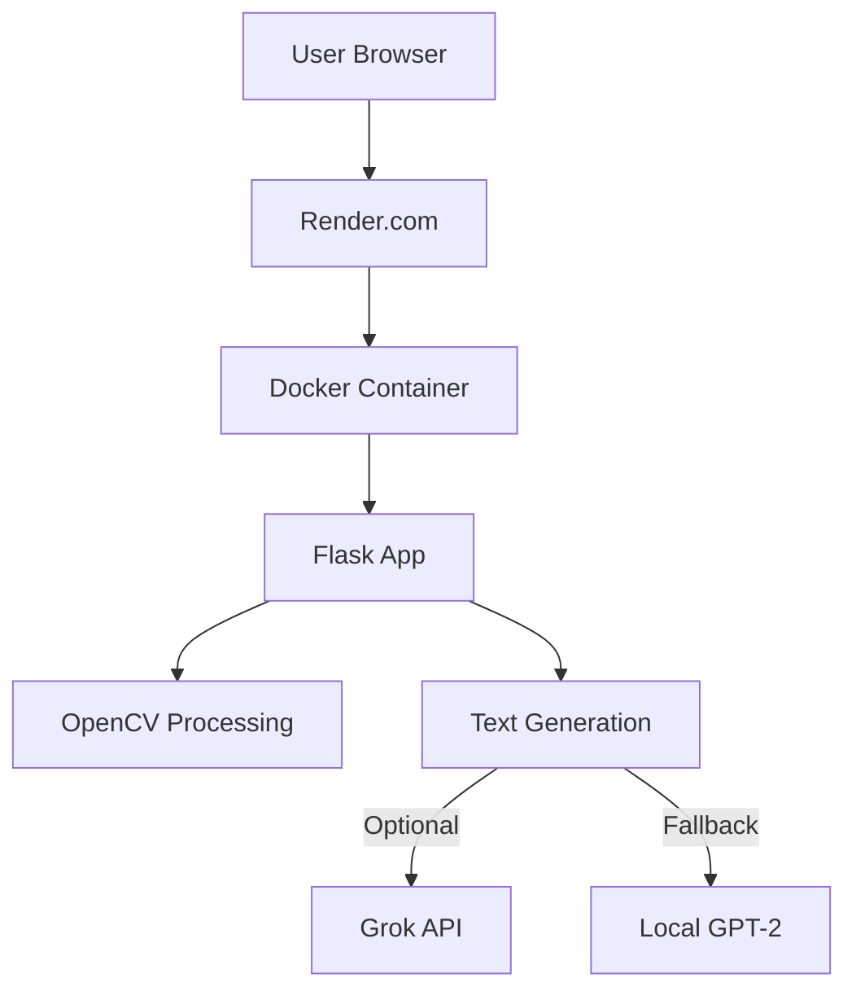
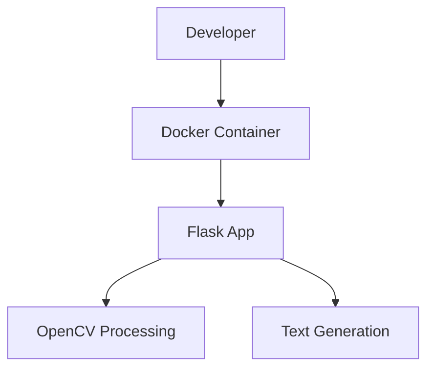

# Comic Panel Description Generator - Technical Context

## Technologies Used

### Core Technologies

| Technology | Version | Purpose |
|------------|---------|---------|
| Python     | 3.9+    | Core programming language |
| OpenCV     | 4.x     | Computer vision for image analysis |
| Flask      | 2.x     | Web framework for interface |
| Docker     | Latest  | Containerization platform |
| Transformers | Latest | Text generation (GPT-2 fallback) |
| Grok API   | Latest  | Primary text generation (if available) |
| Gunicorn   | Latest  | WSGI HTTP Server |

### Development Tools

| Tool       | Version | Purpose |
|------------|---------|---------|
| Git        | 2.x+    | Version control |
| VS Code    | Latest  | Development IDE |
| Pytest     | Latest  | Testing framework (if time permits) |
| Docker Desktop | Latest | Local Docker environment |
| Render.com | N/A     | Deployment platform |

### Libraries and Frameworks

#### Backend/Processing
- **OpenCV**: Computer vision library for image analysis
- **NumPy**: Numerical computing for image processing
- **Flask**: Web framework for the application interface
- **Transformers**: Hugging Face library for text generation
- **Requests**: HTTP library for API calls (Grok API)
- **Werkzeug**: WSGI utilities for Flask

#### Frontend
- **HTML/CSS**: Basic frontend structure and styling
- **JavaScript**: Minimal client-side functionality
- **Bootstrap** (optional): Basic styling if time permits

## Text Generation Strategy

### Dual Approach Implementation
- **Grok API (Primary)**: Used when API key is available, provides higher quality comic-style descriptions
- **GPT-2 (Fallback)**: Local model used when Grok API is unavailable, optimized for comic descriptions

### Prompt Engineering
- **Enhanced Prompts**: Added comic-specific context to prompts ("comic style, short and wild!" for Grok, "comic book action!" for GPT-2)
- **Dynamic Prompting**: Different prompt styles based on the text generation method
- **Context Inclusion**: Incorporating figure count, motion type, and special objects into prompts

### Output Optimization
- **Concise Descriptions**: Reduced max token length from 50 to 30 for more focused descriptions
- **Artifact Removal**: Cleaning file paths and other unwanted artifacts from GPT-2 output
- **Parameter Tuning**: Added top_k=40 to GPT-2 generation to reduce unusual outputs
- **Consistent Formatting**: Ensuring all descriptions follow "Panel X: [description]" format

### Error Handling
- **Graceful Fallback**: Automatic fallback to GPT-2 if Grok API fails
- **Logging**: Comprehensive logging of generation process and errors
- **Default Values**: Providing sensible defaults when generation fails

## Development Setup

### Prerequisites
- Docker installed
- Python 3.9+ (for local development outside container)
- Git
- VS Code (recommended) with Python and Docker extensions

### Local Development Workflow

1. **Clone Repository**
   ```bash
   git clone <repository-url>
   cd comic-panel-description-generator
   ```

2. **Build and Run Docker Container**
   ```bash
   docker build -t comic-ai .
   docker run -p 8000:8000 comic-ai
   ```

3. **Access Development Service**
   - Web Interface: http://localhost:8000

4. **Local Development (Alternative)**
   ```bash
   # Create virtual environment
   python -m venv venv
   source venv/bin/activate  # On Windows: venv\Scripts\activate
   
   # Install dependencies
   pip install -r requirements.txt
   
   # Run development server
   flask run --debug
   ```

## Technical Constraints

### Time Constraints
- Must complete development within 5 hours (11:45 PM to 4:45 AM EST)
- Must prioritize core functionality over perfection
- Must focus on "good enough" results that save artists time

### Docker Constraints
- Must use Python 3.9-slim as base image
- Must include all dependencies in the container
- Must be deployable to Render.com free tier
- Must start quickly and run efficiently

### Performance Constraints
- Image processing must complete within seconds
- Text generation must be reasonably fast
- Web interface must be responsive and simple
- Overall process from upload to results should take under 30 seconds

### Compatibility Constraints
- Must work with JPG and PNG image formats
- Must handle various sketch styles and quality levels
- Must work on modern web browsers
- Must be usable on both desktop and mobile devices

## Dependencies

### External Services
- **Docker Hub**: Container registry for base image
- **PyPI**: Python package repository
- **Render.com**: Deployment platform
- **Grok API** (optional): For enhanced text generation

### Third-Party APIs
- **Grok API** (if available): For high-quality text generation
- **Hugging Face Model Hub**: For GPT-2 model (fallback option)

### Infrastructure Dependencies
- Docker runtime environment
- Internet connectivity for deployment
- Web browser for user interface

## Environment Configuration

### Environment Variables
The application uses environment variables for configuration:

```yaml
# Example environment variables
FLASK_APP=app.py
FLASK_ENV=production
PORT=8000
USE_GROK_API=false  # Set to true if using Grok API
GROK_API_KEY=<api-key>  # Only if using Grok API
MAX_CONTENT_LENGTH=16777216  # 16MB max upload size
```

### Dockerfile
```dockerfile
FROM python:3.9-slim

WORKDIR /app

RUN apt-get update && \
    apt-get install -y libopencv-dev && \
    rm -rf /var/lib/apt/lists/*

COPY requirements.txt .
RUN pip install --no-cache-dir -r requirements.txt

COPY . .

CMD ["gunicorn", "--bind", "0.0.0.0:8000", "app:app"]
```

### requirements.txt
```
flask==2.0.1
gunicorn==20.1.0
opencv-python-headless==4.5.3.56
numpy==1.21.2
transformers==4.11.3
torch==1.9.0
requests==2.26.0
```

## Deployment Architecture

### Production Deployment


### Development Deployment


## Marketing and Monetization

### Pricing Model
- **Subscription**: $20/month for unlimited use
- **One-time Purchase**: $50 for perpetual license

### Marketing Strategy
- **X (Twitter)**: "Comic nerds, AI scripts your panels, $20/month, DM me!"
- **Discord**: Target artist communities and groups
- **Direct Outreach**: Contact comic artists who have complained about scripting

### Deployment Timeline
- **Development**: 5 hours (11:45 PM to 4:45 AM EST)
- **Deployment**: Immediately after development (by 5:00 AM EST)
- **Marketing**: Begin at 9:00 AM EST
- **First Sales**: Target by noon the same day
